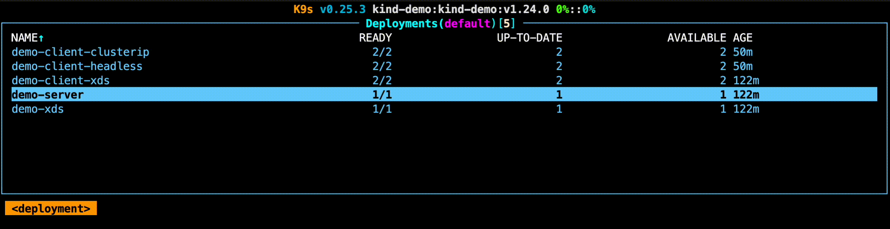

# Demo
This demo illustrates a problem with Kubernetes internal services for usage with gRPC.

- ClusterIP services will be unbalanced, as gRPC connections are created against a single backend and have keep-alive enabled.
- Headless (ClusterIP=None) services will have issues with balancing after a deployment of the target server. The DNS discovery protocol is very slow, and has a built-in minimum discovery of 30 seconds, and a 120 second maximum back-off in case of failure.

To alleviate these issues we can leverage xDS: only the xDS service needs to listen to the Kubernetes API, and all gRPC clients with xDS resolver will receive streaming updates when destinations should be changed.

